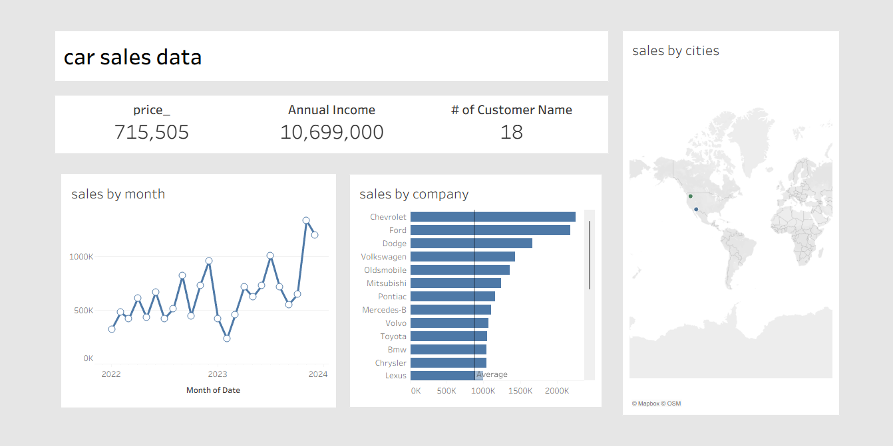

# Tableau_Car_Sales_Analysis
An interactive Tableau dashboard designed to analyze car sales performance across cities, companies, and time periods. The dashboard provides an overview of key sales metrics to support strategic decision-making and performance tracking.  
# Car Sales Data Dashboard | Tableau

## 📊 Overview
An interactive Tableau dashboard designed to analyze and visualize car sales data across different cities, companies, and time periods. The dashboard provides a clear overview of sales performance, customer distribution, and revenue trends to support data-driven decision-making.

## 🔍 Key Insights
- Identified top-performing car brands contributing the highest sales revenue.  
- Tracked monthly sales trends to evaluate performance fluctuations and seasonal patterns.  
- Mapped sales by region to visualize geographic distribution and market potential.  

## 🧠 Tools & Techniques
- Tableau Desktop Public Edition  
- Data Cleaning and Preparation  
- Interactive Filters & Parameters  
- Geographic Mapping and Trend Analysis  

## 📁 Files Included
- `Car_Sales_Dashboard.twbx` – Tableau Packaged Workbook  
- `Dashboard_Screenshot.png` – Preview of the Tableau Dashboard  

## 🌐 Dashboard Preview

## 📈 Outcome
Enhanced understanding of sales performance across multiple dimensions, enabling strategic insights into customer and market behavior.  

---

📎 **GitHub Repository Link:** [Your GitHub Repository URL Here]
